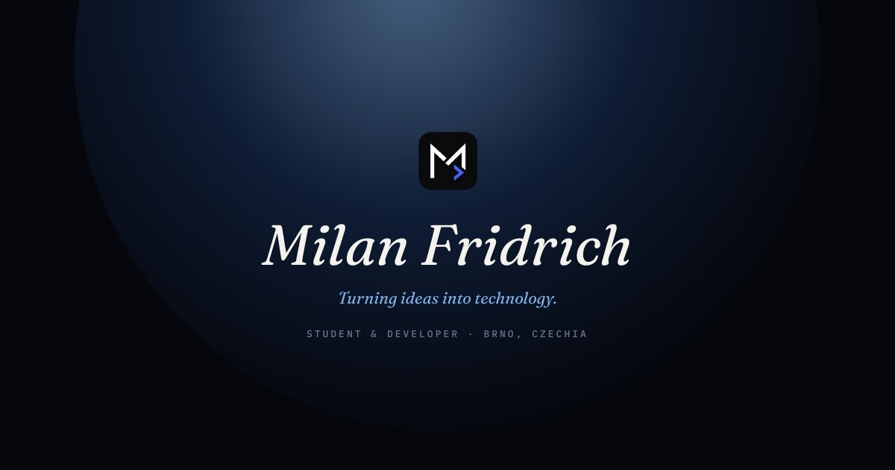

  

<h1 align="center"><i>Milan Fridrich</i></h1>

<i>Turning ideas into technology.</i>

Student &amp; Developer · Brno, Czechia

  <a href="https://milanfridrich.is-a.dev/"><b>🌐 Visit the live portfolio →</b></a>

---

 

## About

A student at an eight-year grammar school in Brno, with a growing interest in software development, AI, and modern technology. Programming is learned mostly hands-on, through building real projects — creating software and web applications, and continually picking up new technologies along the way. What matters just as much as the code itself is figuring out how to turn an idea into an actual, usable product.

I like creating things — starting from an idea and following it all the way through to a working product. Writing code is only part of it; I'm just as interested in how a product gets designed, how its different parts connect, and how to get it into a shape people can actually use.

Right now I'm working on two projects of my own — **Petali** and **Project Pilot** — picking up new technologies as each one needs them. When something breaks, I try to understand why before looking for a fix, rather than just copying a ready-made answer. I use AI as a tool for learning, development, brainstorming, problem-solving, and debugging — it extends what I can do and speeds up how fast I learn, without replacing the thinking or the coding.

Outside of programming, I play badminton, enjoy other sports, and like being outdoors — skiing, cycling, photography, and generally spending time in nature.

 

## Projects

### 🌱 Petali — *01 · Personal project*
**A computer that speaks a language you understand.**

Petali is a personal project that pairs computer monitoring with a visual, living companion on the desktop — turning raw system data into something more approachable and easier to read at a glance. It started as a simple HTML prototype and grew into a full desktop application, pulling in work well beyond the frontend: system monitoring, application packaging, and deployment, plus a separate marketing site to go with it.

**[→ Visit Petali](https://petali.netlify.app)**

 

### 🧭 Project Pilot — *02 · Full-stack project*
**Stay on course.**

Project Pilot is a more ambitious attempt: a full web platform for organizing projects and coordinating the people working on them. Building it means working across the whole stack — frontend, backend, APIs, a database, authentication — plus email handling, user verification, permissions, and deployment. It's still evolving, with new features and fixes being added along the way.

**[→ Visit Project Pilot](https://project-pilot.is-local.org)**

 

## Skills / Technologies

**Technical**

`Programming` `Frontend Development` `Backend Development` `Full-stack Development` `Databases` `REST APIs` `AI` `AI-assisted Development` `Git / GitHub` `Deployment` `Desktop Development` `Modern web technologies`

**Soft skills**

`Communication` `Collaboration` `Teamwork` `Problem Solving` `Critical Thinking` `Creativity` `Adaptability` `Learning` `Organization` `Presentation`

 

## Portfolio website

The full, interactive portfolio — including the About, Projects, and Vision sections — lives at:

**[→ milanfridrich.is-a.dev](https://milanfridrich.is-a.dev/)**

A downloadable resume is also available there as a [PDF](public/milan-fridrich-portfolio.pdf).

 

## Contact

Open to conversations about projects, collaboration, or just talking through an idea.

- ✉️ **Email** — [milan.fridrich3@gmail.com](mailto:milan.fridrich3@gmail.com)
- 🐙 **GitHub** — [github.com/milanfridrich3](https://github.com/milanfridrich3)

 

## License

All rights reserved. See the [LICENSE](LICENSE) file for details.

---

  <i>Turning ideas into technology.</i> 
  © 2026 Milan Fridrich

